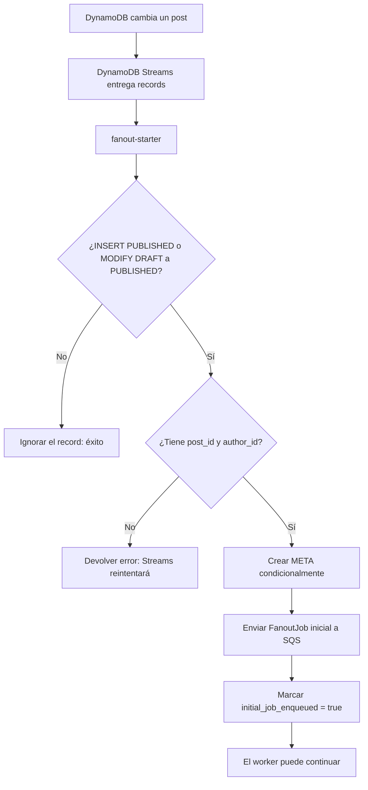

# fanout-starter: iniciar el trabajo de notificación

Esta Lambda no notifica usuarios ni recorre seguidores. Su única responsabilidad es detectar que un post acaba de publicarse y dejar preparado el primer trabajo de fanout.

## Qué recibe y qué produce

| Elemento | Valor |
| --- | --- |
| Disparador | Un lote de registros de DynamoDB Streams de la tabla de posts. |
| Datos que necesita | `eventID` del Stream, `post_id`, `author_id`, estado anterior y estado nuevo. |
| Lee/escribe | Crea y actualiza el ítem `META` en `FanoutProgress`. |
| Publica | Un mensaje inicial en la cola SQS `fanout-jobs`. |
| No hace | No consulta followers y no envía correo, push ni notificaciones finales. |

## Flujo paso a paso



Un solo evento de Stream puede llegar varias veces. Por eso usa el mismo `eventID` como `fanoutId`: un reintento se refiere al mismo proceso y no a una notificación nueva.

## Ejemplo completo

El cambio relevante que llega desde el Stream, simplificado, es:

```json
{
  "eventID": "stream-abc-01",
  "eventName": "MODIFY",
  "dynamodb": {
    "OldImage": { "status": "DRAFT" },
    "NewImage": {
      "status": "PUBLISHED",
      "post_id": "post-900",
      "author_id": "author-42"
    }
  }
}
```

Primero crea este control de progreso en DynamoDB:

```text
PK = FANOUT#STREAM_EVENT#stream-abc-01
SK = META
status = PROCESSING
next_cursor = ""
initial_job_enqueued = false
```

Luego publica este mensaje en `fanout-jobs`:

```json
{
  "eventId": "stream-abc-01",
  "fanoutId": "stream-abc-01",
  "jobId": "stream-abc-01#INITIAL",
  "streamEventId": "stream-abc-01",
  "postId": "post-900",
  "authorId": "author-42",
  "cursor": "",
  "batchNumber": 1
}
```

Por último cambia `initial_job_enqueued` a `true`. El campo permite saber que el primer mensaje ya fue aceptado por SQS.

## Qué cambios sí y no activan el flujo

| Cambio en el post | Resultado |
| --- | --- |
| Crear directamente con `PUBLISHED` | Inicia el fanout. |
| Cambiar de `DRAFT` a `PUBLISHED` | Inicia el fanout. |
| Crear con `DRAFT` | No hace nada. |
| Editar un post que ya estaba `PUBLISHED` | No vuelve a notificar. |
| Cambio que no contiene datos del post | Devuelve error para evitar perder un evento incompleto. |

## Errores y reintentos

El Stream trabaja con entrega **al menos una vez**. Un error real al crear `META`, enviar a SQS o marcar el mensaje hace fallar la invocación y AWS puede volver a entregar el record.

Hay una ventana inevitable: SQS puede aceptar el mensaje y fallar después la actualización de `initial_job_enqueued`. En el reintento se puede mandar otra vez el mismo trabajo lógico. Es aceptable: el worker usa checkpoints y operaciones condicionales para que un duplicado no implique perder followers.

Para ver el contexto global, consulta la [guía de eventos y fanout](../../../documentacion/03-eventos-fanout-y-resiliencia.md).
