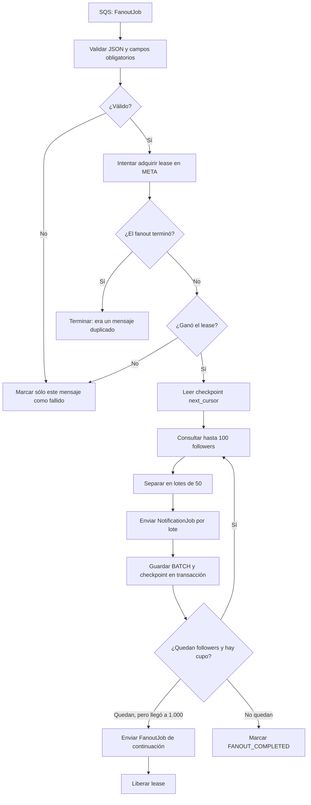
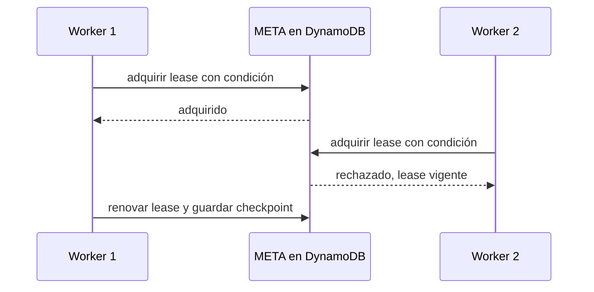

# follower-fanout-worker: convertir seguidores en lotes de notificación

Esta Lambda recibe un trabajo de fanout y lo avanza de forma segura. No entrega una notificación final: prepara mensajes para que otro consumidor notifique a los destinatarios.

## Qué recibe y qué produce

| Elemento | Valor |
| --- | --- |
| Disparador | Uno o más mensajes de SQS `fanout-jobs`. |
| Entrada | `eventId`, `fanoutId`, `jobId`, `postId`, `authorId` y cursor. |
| Consulta | Seguidores del autor en DynamoDB, de 100 en 100. |
| Escribe | `META` y los `BATCH` de progreso en `FanoutProgress`. |
| Publica | Mensajes de hasta 50 recipients en `notification-jobs`. |
| Límite por invocación | Procesa como máximo 1.000 seguidores. |

## Flujo paso a paso



## Ejemplo: 250 seguidores

Supón que `author-42` publicó `post-900` y tiene 250 seguidores.

```text
Página 1: followers 1..100  -> NotificationJob 1 (1..50), 2 (51..100)
Página 2: followers 101..200 -> NotificationJob 3 (101..150), 4 (151..200)
Página 3: followers 201..250 -> NotificationJob 5 (201..250)
```

El resultado son **3 páginas**, **5 mensajes de notificación** y un `META` terminado. Cada mensaje de salida contiene los destinatarios, no una llamada directa a un proveedor de correo o push:

```json
{
  "eventId": "stream-abc-01",
  "postId": "post-900",
  "authorId": "author-42",
  "recipients": ["user-201", "user-202"],
  "batchNumber": 5
}
```

## Checkpoint: por qué no confía sólo en el mensaje SQS

Después de procesar una página, guarda `next_cursor` en `META`. Ese valor es la fuente de verdad del avance:

```text
Antes de página 2: next_cursor = cursor después de follower 100
Después de página 2: next_cursor = cursor después de follower 200
Al terminar:        status = FANOUT_COMPLETED
```

Si SQS reentrega el trabajo inicial, el worker relee `META` y retoma desde el cursor guardado, no desde el cursor viejo del mensaje. Así no vuelve a recorrer el proceso desde cero.

## Lease: evitar dos workers a la vez

Dos mensajes duplicados pueden activar dos Lambdas. Ambas pueden leer el mismo `META`, pero solamente una gana la escritura condicional del lease.



El worker que no gana devuelve un fallo parcial para ese mensaje. SQS lo reintentará más tarde, cuando el lease se libere o venza.

## Errores, reintentos y salida parcial

- JSON inválido o campos obligatorios vacíos: falla sólo ese `messageId`.
- Error consultando followers, publicando notificaciones o guardando checkpoint: falla sólo ese mensaje; los demás del lote SQS no se repiten.
- Fanout ya completado: éxito sin volver a enviar nada.
- Lease de otro worker: fallo recuperable; no consulta ni publica nada.
- Si quedan más de 1.000 followers: crea un mensaje de continuación con el cursor alcanzado y libera el lease sólo después de que SQS acepta la continuación.

La cola es *at least once*: pueden existir duplicados. Los identificadores deterministas y los `BATCH` condicionales hacen que repetir trabajo sea recuperable; perder destinatarios no lo sería.

Consulta la [guía de fanout](../docs/fanout-notificaciones.md) para el modelo completo de `META`, batches y recuperación.
