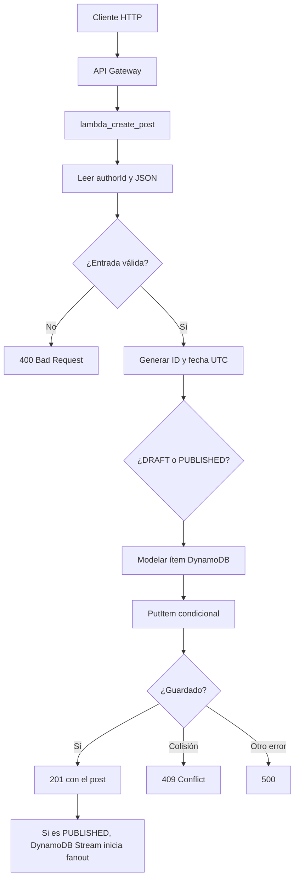

# lambda_create_post: crear un post

Esta Lambda atiende la petición HTTP que crea un post. Su trabajo termina al guardar el post: si se crea como publicado, DynamoDB Streams activará después el flujo asíncrono de fanout.

## Contrato HTTP

```text
POST /authors/{authorId}/posts
Content-Type: application/json
```

Entrada de ejemplo:

```json
{
  "description": "Nueva guía de DynamoDB",
  "status": "PUBLISHED"
}
```

Salida exitosa (`201 Created`):

```json
{
  "postId": "post-generado-por-la-lambda",
  "authorId": "author-42",
  "status": "PUBLISHED",
  "createdAt": "2026-08-31T15:00:00Z",
  "publishedAt": "2026-08-31T15:00:00Z",
  "updatedAt": "2026-08-31T15:00:00Z",
  "description": "Nueva guía de DynamoDB"
}
```

## Flujo paso a paso



## Reglas y almacenamiento

El handler exige `authorId`, JSON válido, `description` no vacía y `status` igual a `DRAFT` o `PUBLISHED`. También rechaza campos JSON desconocidos y cuerpos mayores de 1 MiB.

El caso de uso limpia espacios, genera un UUID y asigna `createdAt` y `updatedAt`. Para `PUBLISHED`, también asigna `publishedAt` en el mismo instante. El adaptador guarda con una condición de inexistencia: una colisión de clave devuelve `409`, nunca sobrescribe un post existente.

| Estado | Dónde se puede consultar | Efecto posterior |
| --- | --- | --- |
| `DRAFT` | Índice `draft_gsi`, además de la tabla base | No inicia fanout. |
| `PUBLISHED` | Tabla base | El INSERT aparece en DynamoDB Streams y puede iniciar fanout. |

## Errores visibles para el cliente

| Situación | Respuesta |
| --- | --- |
| Falta `authorId`, descripción o estado inválido | `400 Bad Request` con `message`. |
| JSON mal formado o con campo no permitido | `400 Bad Request`. |
| La clave ya existe | `409 Conflict`. |
| DynamoDB u otro error inesperado | `500 Internal Server Error`. |

Esta Lambda responde rápido: no espera a que se avise a los seguidores. Ese trabajo pertenece a [fanout-starter](../fanout_starter/README.md) y al worker.
