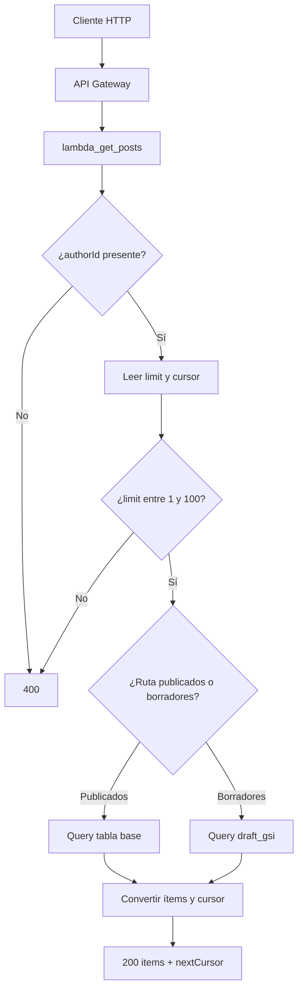

# lambda_get_posts: consultar posts paginados

Esta Lambda atiende las consultas HTTP de posts. Sólo lee DynamoDB; no crea posts, no publica mensajes y no inicia fanout.

## Rutas y ejemplos

| Ruta | Qué devuelve | Fuente de datos |
| --- | --- | --- |
| `GET /authors/{authorId}/posts` | Posts publicados del autor. | Tabla base, lectura fuertemente consistente. |
| `GET /authors/{authorId}/drafts` | Borradores del autor. | Índice `draft_gsi`, con consistencia eventual. |

Ejemplo de petición:

```text
GET /authors/author-42/posts?limit=2
```

Respuesta (`200 OK`):

```json
{
  "items": [
    {
      "postId": "post-900",
      "authorId": "author-42",
      "createdAt": "2026-08-31T15:00:00Z",
      "publishedAt": "2026-08-31T15:00:00Z",
      "updatedAt": "2026-08-31T15:00:00Z",
      "description": "Nueva guía de DynamoDB"
    }
  ],
  "nextCursor": "cursor-opaco-si-hay-mas-resultados"
}
```

## Flujo paso a paso



## Paginación explicada

`limit` es opcional: si no llega, usa `10`; puede valer entre `1` y `100`. DynamoDB no devuelve un número de página sino una clave para continuar. La Lambda la codifica como `nextCursor` para que el cliente no construya claves internas.

```text
1. GET .../posts?limit=2                 -> items 1 y 2, nextCursor = abc
2. GET .../posts?limit=2&cursor=abc      -> items 3 y 4, nextCursor = def
3. GET .../posts?limit=2&cursor=def      -> últimos items, sin nextCursor
```

Un cursor inválido devuelve `400`. El cliente debe devolver exactamente el `nextCursor` recibido, sin intentar interpretarlo.

## Diferencia importante entre las dos rutas

Los publicados se consultan desde la tabla principal con lectura fuerte: después de un `200` de escritura, la lectura busca reflejar el dato confirmado. Los borradores viven también en el índice `draft_gsi`, que DynamoDB actualiza de forma eventual; justo después de crear un draft puede tardar brevemente en aparecer en esa ruta.

## Errores visibles para el cliente

| Situación | Respuesta |
| --- | --- |
| `authorId` vacío | `400 Bad Request`. |
| `limit` no numérico, menor que 1 o mayor que 100 | `400 Bad Request`. |
| Cursor no válido | `400 Bad Request`. |
| Error de DynamoDB | `500 Internal Server Error`. |
