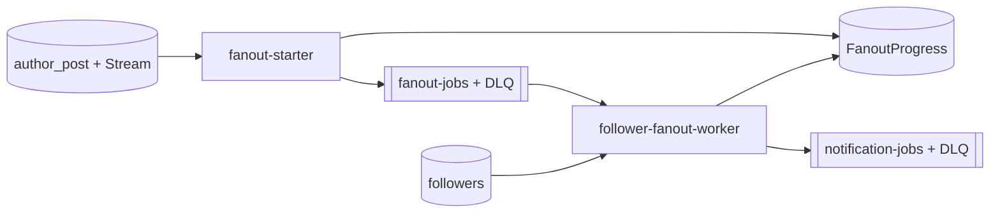

# 3. Eventos, fanout y resiliencia

## Arquitectura



El editor no espera notificar a miles de personas. El Stream inicia un proceso corto; SQS desacopla el trabajo paginado y reintentable.

## Contrato y algoritmo

```json
{
  "eventId": "<DynamoDB-Stream-eventID>",
  "postId": "post-123",
  "authorId": "author-1",
  "cursor": "<base64 o vacío>",
  "batchNumber": 1
}
```

El worker obtiene `META.next_cursor` con lectura fuerte y repite hasta 1.000 followers: `Query` por `FOLLOWING#author` con límite 100, envía recipients en batches de 50, y usa `TransactWriteItems` para guardar `BATCH` y avanzar `META.next_cursor`. Si queda cursor, encola una continuación.

El identificador de batch es determinista: evento + cursor inicial + parte. Los `BATCH` usan condición de no existencia, así los reintentos no suman dos veces contadores de páginas ya confirmadas.

## Reintentos y checkpoint

SQS es *at least once*. Si se confirmaron seis páginas de 100 followers, el retry continúa desde el checkpoint y no desde cero. Solo puede repetirse la página enviada a SQS antes de persistir su progreso. Duplicar un batch es recuperable; perder un recipient no.

Partial batch response hace que un mensaje fallido no fuerce a reintentar los demás mensajes del batch Lambda. Al agotar reintentos, el job llega a la DLQ con el cursor y contexto para repararlo.

## Idempotencia final

Que un job esté encolado no significa que el usuario fue notificado. El futuro writer debe guardar una fila determinista por destinatario:

```text
PK = USER#<recipientId>
SK = POST#<postId>
ConditionExpression = attribute_not_exists(PK) AND attribute_not_exists(SK)
```

El `PutItem` condicional es atómico: una ejecución gana y una concurrente recibe `ConditionalCheckFailedException`, que se trata como éxito. No usar `BatchWriteItem` para deduplicar porque no soporta condiciones. Un push/email externo necesita su propia estrategia de idempotencia.

## Pruebas que demuestran el diseño

- DRAFT a PUBLISHED inicia una vez el fanout lógico.
- 250 followers con páginas de 100 producen cinco batches de 50.
- Fallar después del 600 retoma desde el checkpoint 600.
- Fallar entre SQS y checkpoint puede repetir una página, pero el writer no duplica su registro.
- Cero followers termina en `FANOUT_COMPLETED`; agotar reintentos termina en DLQ.
