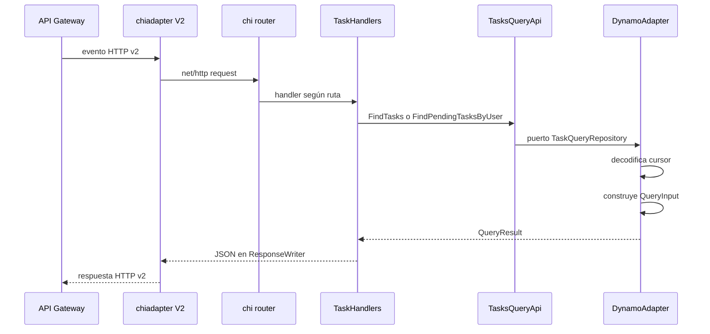

# `get_tasks_querys`

## Propósito

Sirve dos consultas paginadas para un dueño: su historial completo de tareas y su lista de pendientes ordenada por vencimiento. Ambas usan `Query` sobre la tabla base y nunca usan `Scan`.

## Integración

| Ruta | Clave consultada | Items obtenidos |
| --- | --- | --- |
| `GET /tasks/{ownerId}` | `PK = OWNER_ID#...`, `SK` empieza por `TASK_ID#` | Items principales |
| `GET /tasks/{ownerId}/pending` | `PK = OWNER_ID#...`, `SK` empieza por `STATUS#PENDING#` | Proyecciones pendientes |

La variable principal es `TASK_TABLE_NAME`. Existe compatibilidad con `TABLENAME`, pero CDK configura `TASK_TABLE_NAME`. El rol solo necesita `dynamodb:Query` sobre la tabla.

Respuesta:

```json
{
  "tasks": [
    {
      "task_id": "task-123",
      "owner_id": "alice",
      "description": "Pagar la factura",
      "created_at": "2026-09-14T15:00:00Z",
      "expired_at": "2026-09-20T18:00:00Z",
      "status": "PENDING"
    }
  ],
  "cursor": "eyJQSyI6Li4ufQ"
}
```

`cursor` se omite cuando no existe otra página.

## Particularidad del handler

Esta Lambda usa `chi`, un router HTTP Go. `aws-lambda-go-api-proxy/chi` convierte el evento API Gateway v2 en `http.Request` y convierte el `http.ResponseWriter` de vuelta a la respuesta de Lambda.



## Recorrido interno

### 1. Composición y rutas

`main.go` carga AWS, obtiene el nombre de tabla, construye repositorio, caso de uso y handlers. `createRouter` registra primero la ruta más específica `/pending` y luego la general.

Los middlewares agregan un request ID y resuelven la IP real. El adaptador `chiadapter.NewV2` es necesario porque la infraestructura usa payload format 2.0.

### 2. Handlers

Cada handler:

1. lee y normaliza `ownerId`;
2. lee el cursor opcional del query string;
3. rechaza dueño vacío con `400`;
4. llama al método correspondiente del puerto de entrada;
5. convierte `InvalidCursor` en `400` y los demás fallos en `500`;
6. codifica `QueryResult` como JSON.

### 3. Caso de uso

`TasksQueryApi` valida la dependencia y el dueño, delega al repositorio y envuelve el error con contexto. Tiene dos métodos porque cada consulta representa un access pattern distinto, aunque compartan modelos y formato de respuesta.

### 4. Consulta de todas las tareas

`GetUserTasks` usa:

```text
PK = OWNER_ID#<ownerId>
begins_with(SK, TASK_ID#)
Limit = 10
ConsistentRead = true
```

El prefijo excluye las proyecciones `STATUS#PENDING#...`. Como la sort key contiene un UUID y no `created_at`, el orden representa el orden lexicográfico del identificador, no el orden de creación. La línea comentada sobre `ScanIndexForward=false` no cambia la consulta porque el campo no está asignado.

### 5. Consulta de pendientes

`GetPendingTasksByUser` usa:

```text
PK = OWNER_ID#<ownerId>
begins_with(SK, STATUS#PENDING#)
Limit = 10
ConsistentRead = true
```

La sort key contiene primero `expired_at`, así que el orden ascendente predeterminado entrega primero las tareas con vencimiento más cercano.

El mapper asigna `PENDING` sin leer un atributo `status`, porque la propia clave de la proyección garantiza esa condición.

### 6. Cursor

Antes del `Query`, `util.Decode`:

1. acepta una cadena vacía como primera página;
2. decodifica Base64 URL-safe sin padding;
3. exige un JSON `map[string]string`;
4. reconstruye `ExclusiveStartKey` con atributos DynamoDB de tipo string.

Después de la consulta, `util.Encode` realiza el camino inverso sobre `LastEvaluatedKey`. El cliente debe tratar el resultado como opaco y reenviarlo sin modificar.

Un cursor inválido nunca llega a DynamoDB: se devuelve `InvalidCursor` y el handler responde `400`.

### 7. Mapeo

`getDomain` convierte todos los items y el cursor. Los campos `task_id`, `owner_id` y `description` son obligatorios. `created_at` y `expired_at` son punteros opcionales; si faltan o no usan RFC3339, se omiten del JSON.

## Errores HTTP

| Situación | Código | Respuesta |
| --- | --- | --- |
| Página correcta, incluso vacía | `200` | `{"tasks":[]}` y cursor si existe |
| `ownerId` vacío | `400` | mensaje de validación |
| Cursor inválido | `400` | `cursor inválido` |
| DynamoDB o item inválido | `500` | mensaje genérico |

## Archivos para estudiar

| Archivo | Responsabilidad |
| --- | --- |
| [`main.go`](main.go) | Wiring, router y adaptador API Gateway |
| [`internal/handlers/handlers.go`](internal/handlers/handlers.go) | Entrada/salida `net/http` |
| [`internal/domain/in/entry_point.go`](internal/domain/in/entry_point.go) | Puerto de entrada con dos consultas |
| [`internal/application/task_api_impl.go`](internal/application/task_api_impl.go) | Validación y delegación |
| [`internal/domain/out/get_info_port.go`](internal/domain/out/get_info_port.go) | Puerto del repositorio |
| [`internal/infraestructure/dynamo_adapter.go`](internal/infraestructure/dynamo_adapter.go) | Queries y mapeadores |
| [`internal/infraestructure/util/utils.go`](internal/infraestructure/util/utils.go) | Codec del cursor HTTP |

## Qué verifican las pruebas

- Cada método del caso de uso llama al repositorio correcto.
- Los errores del repositorio conservan su identidad al envolverse.
- Un dueño vacío se rechaza antes de consultar.
- Las dos expresiones de clave, sus límites y sus resultados se construyen correctamente.

## Preguntas de repaso

1. ¿Por qué ambas rutas pueden consultar la misma partición sin mezclar items?
2. ¿Qué parte de la sort key ordena las pendientes?
3. ¿Por qué el cursor contiene una clave y no un número de página?
4. ¿Qué función cumple `chiadapter.NewV2`?
