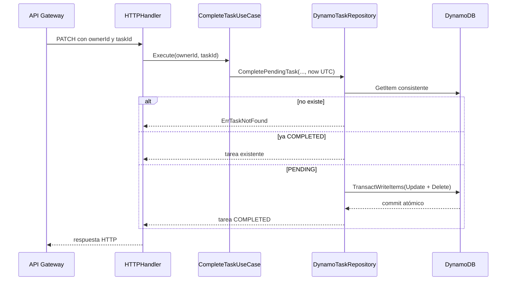

# `lambda_complete_task`

## Propósito

Marca una tarea como completada y la retira de todas las vistas de pendientes. Repetir la misma solicitud devuelve el estado completado existente, por lo que la operación es idempotente.

## Integración

| Elemento | Valor |
| --- | --- |
| Disparador | API Gateway HTTP API v2 |
| Ruta | `PATCH /tasks/{ownerId}/{taskId}/complete` |
| Variable | `TASK_TABLE_NAME` |
| Permisos IAM | `dynamodb:GetItem`, `dynamodb:TransactWriteItems` |
| Respuesta exitosa | `200 OK` con la tarea completada |

## Recorrido interno



### 1. Composición

`main.go` carga `TASK_TABLE_NAME`, crea el cliente DynamoDB y conecta:

```text
DynamoDB client -> DynamoTaskRepository -> CompleteTaskUseCase -> HTTPHandler
```

### 2. Handler

El handler obtiene `ownerId` y `taskId` desde `PathParameters`. Delega las reglas al caso de uso y convierte errores conocidos a `400`, `404` o `409`. El éxito siempre se serializa como JSON con `200`.

### 3. Caso de uso

`CompleteTaskUseCase.Execute`:

1. verifica que exista un repositorio;
2. normaliza ambos IDs con `TrimSpace`;
3. rechaza valores vacíos con `ErrInvalidID`;
4. obtiene `now` y lo convierte a UTC;
5. delega la transición al repositorio.

La regla dependiente del estado vive en el repositorio porque necesita observar y modificar DynamoDB de forma coordinada. El caso de uso conserva la orquestación y el reloj inyectable.

### 4. Lectura previa

El repositorio calcula:

```text
PK = OWNER_ID#<ownerId>
SK = TASK_ID#<taskId>
```

Hace `GetItem` con `ConsistentRead=true`. La lectura fuerte reduce la posibilidad de decidir con un estado anterior del item principal.

Después mapea atributos obligatorios y fechas. Si falta un atributo o una fecha es inválida, retorna un error en vez de construir una tarea parcial.

### 5. Idempotencia

Si el estado leído ya es `COMPLETED`, el repositorio devuelve la misma tarea sin escribir. Esto hace seguras repeticiones causadas por un cliente que perdió la respuesta HTTP.

Si el estado no es `PENDING` ni `COMPLETED`, retorna `ErrTaskNotPending` porque la transición no está definida.

### 6. Transacción de completado

Para una tarea pendiente calcula la clave exacta de su proyección:

```text
STATUS#PENDING#EXPIRED_AT#<expired_at>#TASK_ID#<taskId>
```

La transacción contiene:

1. `Update` del item principal con condición `status = PENDING`.
2. `Delete` de la proyección pendiente.

El `UpdateExpression`:

```text
SET status = COMPLETED, completed_at = <now>
REMOVE GSI1PK, GSI1SK
```

Remover las claves saca el principal del GSI disperso. Borrar la proyección lo saca de la consulta pending del dueño. La transacción impide que solo una de esas dos acciones quede confirmada.

La condición vuelve a comprobar `PENDING` en el momento de escribir. Si otra solicitud completó la tarea después del `GetItem`, DynamoDB cancela la transacción. La implementación traduce esa cancelación a `ErrTaskNotPending`; un nuevo intento leerá `COMPLETED` y responderá idempotentemente.

## Respuestas y errores

| Situación | Código |
| --- | --- |
| Pendiente completada | `200` |
| Ya completada | `200`, sin nueva escritura |
| IDs vacíos | `400` |
| Tarea inexistente | `404` |
| Estado no pendiente o carrera de escritura | `409` |
| Error inesperado | `500` |

## Archivos para estudiar

| Archivo | Responsabilidad |
| --- | --- |
| [`main.go`](main.go) | Construcción de dependencias |
| [`domain/task.go`](domain/task.go) | Estados, entidad y errores |
| [`domain/ports/in/complete_task.go`](domain/ports/in/complete_task.go) | Contrato del caso de uso |
| [`domain/ports/out/task_repository.go`](domain/ports/out/task_repository.go) | Contrato de persistencia |
| [`internal/handler/http.go`](internal/handler/http.go) | Traducción HTTP |
| [`internal/application/complete_task.go`](internal/application/complete_task.go) | Validación y hora de transición |
| [`internal/infraestructure/dynamo_task_repository.go`](internal/infraestructure/dynamo_task_repository.go) | Lectura fuerte, mapeo y transacción |

## Qué verifican las pruebas

- Una tarea pendiente provoca un `Update` del principal y un `Delete` de la proyección.
- La respuesta contiene `COMPLETED` y `completed_at`.
- Una tarea ya completada se devuelve sin ejecutar la transacción.

## Preguntas de repaso

1. ¿Por qué se necesita conocer `expired_at` antes de borrar la proyección?
2. ¿Qué dos mecanismos retiran la tarea de las vistas pendientes?
3. ¿Qué carrera cubre la condición `status = PENDING`?
4. ¿Por qué una segunda petición puede devolver `200` sin escribir?
