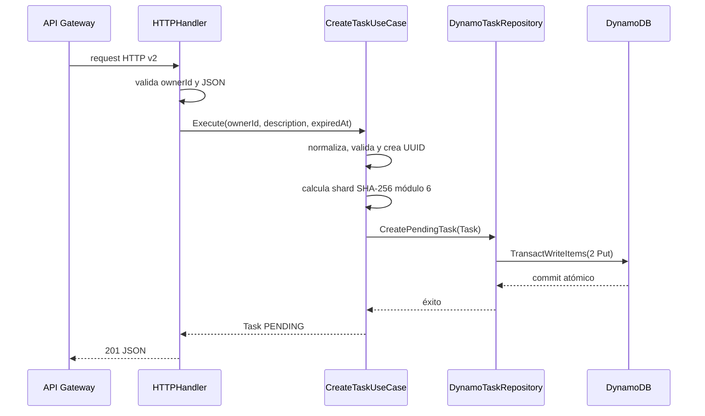

# `lambda_create_task`

## Propósito

Crea una tarea pendiente y deja preparadas, en una sola operación atómica, las tres formas en que el sistema necesita encontrarla:

1. por su dueño e identificador;
2. dentro de las pendientes del dueño, ordenada por vencimiento;
3. dentro de las pendientes globales, repartida en uno de seis shards.

## Integración

| Elemento | Valor |
| --- | --- |
| Disparador | API Gateway HTTP API v2 |
| Ruta | `POST /tasks/{ownerId}` |
| Variable | `TASK_TABLE_NAME` |
| Permiso IAM | `dynamodb:TransactWriteItems` sobre la tabla de tareas |
| Respuesta exitosa | `201 Created` con la tarea |

Entrada de ejemplo:

```json
{
  "description": "Pagar la factura",
  "expired_at": "2026-09-20T18:00:00Z"
}
```

`ownerId` llega como parámetro de ruta. `expired_at` se decodifica directamente a `time.Time`, por lo que debe ser una fecha RFC3339 válida.

## Recorrido interno



### 1. Composición en `main.go`

`main` obtiene `TASK_TABLE_NAME`, carga la configuración por defecto de AWS, crea un cliente DynamoDB e inyecta las dependencias:

```text
DynamoDB client -> DynamoTaskRepository -> CreateTaskUseCase -> HTTPHandler
```

La construcción ocurre durante el cold start. El runtime después reutiliza el handler y los clientes mientras la instancia permanezca caliente.

### 2. Handler HTTP

`internal/handler/http.go`:

1. toma `ownerId` de `PathParameters` y elimina espacios externos;
2. crea un decoder JSON con `DisallowUnknownFields`;
3. rechaza dueño vacío, JSON mal formado o campos desconocidos;
4. llama al puerto `CreateTask.Execute`;
5. traduce errores de dominio a HTTP;
6. serializa la tarea con `Content-Type: application/json`.

### 3. Caso de uso

`internal/application/create_task.go` conserva las reglas que no dependen de AWS:

- dueño y descripción no pueden quedar vacíos después de `TrimSpace`;
- la descripción tiene máximo 1000 caracteres;
- `expired_at` debe existir y estar estrictamente después de `now`;
- todas las fechas se normalizan a UTC;
- el estado inicial siempre es `PENDING`;
- el identificador es un UUID v4 generado con `crypto/rand`.

El shard se calcula con el primer byte de `SHA-256(task_id) % 6` y se representa como `00` a `05`. La función es determinista: el mismo `task_id` siempre produce el mismo shard.

Las funciones `now` y `newID` son campos del caso de uso para que las pruebas puedan controlar tiempo e identidad sin modificar la regla real.

### 4. Puerto de salida

`domain/ports/out.TaskRepository` expone una única capacidad: `CreatePendingTask`. El caso de uso sabe que debe persistir una tarea pendiente; no conoce `TransactWriteItems`, nombres de atributos ni AWS SDK.

### 5. Adaptador DynamoDB

`CreatePendingTask` construye dos items con la misma `PK = OWNER_ID#<ownerId>`:

| Item | `SK` | Uso |
| --- | --- | --- |
| Principal | `TASK_ID#<taskId>` | Historial completo del dueño |
| Proyección | `STATUS#PENDING#EXPIRED_AT#<fecha>#TASK_ID#<taskId>` | Pendientes del dueño ordenadas por fecha |

El principal recibe además:

```text
GSI1PK = SHARD#<00..05>#STATUS#PENDING
GSI1SK = EXPIRED_AT#<expired_at>#TASK_ID#<taskId>
```

Los dos `Put` usan `attribute_not_exists(PK) AND attribute_not_exists(SK)` y se envían juntos en `TransactWriteItems`. DynamoDB crea ambos o ninguno. Esto evita que una tarea exista en el historial pero falte en la vista pending, o al revés.

## Respuestas y errores

| Situación | Código | Mensaje o resultado |
| --- | --- | --- |
| Creación correcta | `201` | Tarea `PENDING` |
| Dueño/body inválido | `400` | `ownerId y body válido son obligatorios` |
| Regla de tarea inválida | `400` | Error de dominio, incluida fecha no futura |
| Colisión/cancelación de transacción | `409` | `la tarea ya existe` envuelto con contexto |
| Error inesperado | `500` | `no se pudo crear la tarea` |

El mensaje genérico de `500` evita filtrar detalles internos del SDK. El error envuelto permanece disponible en logs y pruebas.

## Archivos para estudiar

| Archivo | Responsabilidad |
| --- | --- |
| [`main.go`](main.go) | Composition root y arranque Lambda |
| [`domain/task.go`](domain/task.go) | Entidad, estado inicial y errores |
| [`domain/ports/in/create_task.go`](domain/ports/in/create_task.go) | Operación de entrada |
| [`domain/ports/out/task_repository.go`](domain/ports/out/task_repository.go) | Capacidad de persistencia requerida |
| [`internal/handler/http.go`](internal/handler/http.go) | Adaptación HTTP |
| [`internal/application/create_task.go`](internal/application/create_task.go) | Validación, UUID, fecha y shard |
| [`internal/infraestructure/dynamo_task_repository.go`](internal/infraestructure/dynamo_task_repository.go) | Claves y transacción DynamoDB |

## Qué verifican las pruebas

- El caso de uso normaliza datos, asigna `PENDING`, UTC y un shard válido.
- Una fecha vencida se rechaza y los errores del repositorio conservan su causa.
- El adaptador escribe exactamente el principal y la proyección con las claves del GSI.

## Preguntas de repaso

1. ¿Por qué la proyección se crea en la misma transacción que el item principal?
2. ¿Qué consulta habilita incluir `expired_at` en la sort key?
3. ¿Por qué el shard se calcula desde `task_id` y no desde la fecha?
4. ¿Qué inconsistencia aparecería si solo se escribiera el principal?
