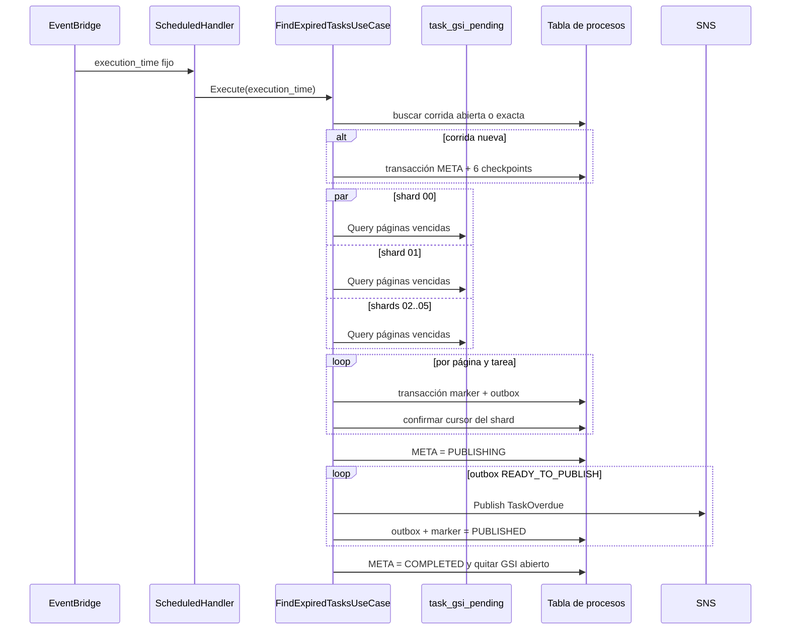
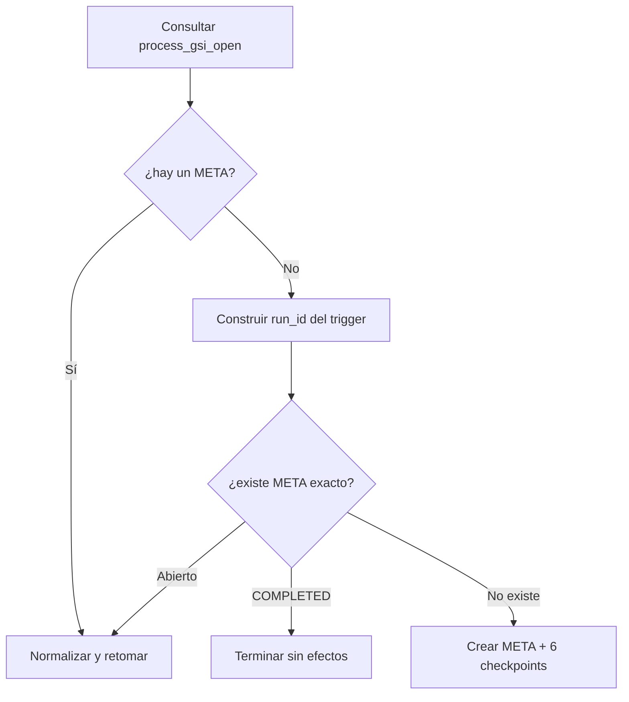

# `lambda_find_expired_task`

## Propósito

Ejecuta el proceso diario que encuentra tareas pendientes vencidas en toda la aplicación, prepara un evento durable por cada una y publica `TaskOverdue` en SNS. Puede retomar una corrida interrumpida sin volver a empezar los shards ya terminados.

Esta es la Lambda con más coordinación del ejercicio. Separa dos fases:

1. **Descubrimiento:** consulta seis shards, reserva eventos y confirma checkpoints.
2. **Publicación:** vacía el outbox hacia SNS y confirma cada evento.

## Integración y configuración

| Elemento | Valor |
| --- | --- |
| Disparador | Regla EventBridge diaria |
| Horario CDK | `05:00 UTC` |
| Entrada | `execution_time` generado desde la fecha del evento |
| Variables | `TASK_TABLE_NAME`, `PROCESS_TABLE_NAME`, `TASK_OVERDUE_TOPIC_ARN` |
| Timeout / memoria | 900 segundos / 512 MiB |
| Concurrencia reservada | 1 |
| Reintentos del target | 2 durante un máximo de 2 horas |
| Fallo definitivo | SQS DLQ |

Permisos:

- `Query` sobre `task_gsi_pending`;
- `GetItem`, `Query`, `UpdateItem` y `TransactWriteItems` sobre tabla de procesos y `process_gsi_open`;
- `sns:Publish` sobre el topic.

Evento esperado:

```json
{
  "execution_time": "2026-09-15T05:00:00Z"
}
```

El handler también acepta el campo estándar `time` de EventBridge como fallback. Siempre normaliza el valor mediante el caso de uso antes de crear una corrida.

## Vista completa



## Composición en `main.go`

`main` usa un solo cliente DynamoDB para tres roles:

```text
DynamoQueryOverDueAdapter              -> consulta tareas vencidas
DynamoProcessAdapter[ProcessModel]      -> META, proceso abierto y progreso
DynamoProcessAdapter[ProcessShardModel] -> checkpoints
SNSRecipient                            -> publicación
```

Los genéricos del adaptador de procesos permiten reutilizar `FindProcess` y el mapeo por tags `dynamo` para `ProcessModel` y `ProcessShardModel`.

## 1. Handler programado

`internal/handler/scheduled.go`:

1. verifica que el caso de uso exista;
2. prefiere `execution_time` si está presente;
3. usa `event.time` en UTC como fallback;
4. rechaza un evento sin ninguna fecha;
5. llama `Execute` y envuelve el error con la fecha procesada.

El handler no calcula `time.Now()`. El disparador define la frontera temporal de la corrida.

## 2. Validación e identidad temporal

`Execute` valida sus cinco dependencias y exige entre 1 y 99 shards. En la configuración real usa 6 y TTL de checkpoints de 7 días.

`parseExecutionTime` exige RFC3339/RFC3339Nano y convierte a UTC. El identificador canónico es:

```text
run_id = OVERDUE_RUN#<execution_time UTC>
```

La misma fecha se usa en cada query. Así una tarea que vence después del corte no entra porque el reintento ocurrió más tarde.

## 3. Resolver la corrida

`resolveProcess` sigue este orden:



Una corrida abierta puede estar en `RUNNING`, `PUBLISHING` o `FAILED_RETRYABLE`. Más de un proceso abierto se considera un error de integridad.

La creación inicial usa una sola transacción de siete items: `META` más checkpoints `SHARD#00` a `SHARD#05`. Todos los `Put` son condicionales. `META` recibe las claves de `process_gsi_open`; los checkpoints reciben TTL.

## 4. Cargar y seleccionar checkpoints

Para una corrida retomada, `loadCheckpoints` hace una lectura fuerte por cada shard. Completa en memoria `shard_id` y `run_id` si faltan en datos antiguos.

`processShards` omite checkpoints `COMPLETED` y abre una goroutine por cada shard restante. Un `WaitGroup` espera a todos. Si un worker falla, envía el error y cancela el contexto compartido para cortar trabajo innecesario. `errors.Join` conserva fallos concurrentes.

La concurrencia interna de seis workers es distinta de la concurrencia de Lambda. CDK limita la segunda a una invocación activa para que dos corridas no compitan por crear el proceso abierto.

## 5. Query por shard

`DynamoQueryOverDueAdapter.GetOverDueTasks` decodifica el cursor y construye:

```text
IndexName = task_gsi_pending
GSI1PK    = SHARD#<shardId>#STATUS#PENDING
GSI1SK BETWEEN EXPIRED_AT#
           AND EXPIRED_AT#<executionTime>#\uFFFF
Limit = 25
```

Cada query solo toca una partición lógica y un rango de fechas. Se ejecutan seis queries iniciales, una por shard, y nuevas páginas únicamente cuando DynamoDB devuelve `LastEvaluatedKey`.

El codec del batch conserva el tipo de cada componente del cursor (`S`, `N` o `B`) en JSON y luego usa Base64 URL-safe. Esta representación puede round-trippear una clave de GSI completa.

`ConverterDynamo` usa reflexión y los tags `dynamo` de `TaskModel`. Exige que todos sus campos mapeables existan y convierte strings, números, booleanos y punteros a `time.Time`. Un item incompleto falla de forma visible.

## 6. Procesar una página

`processShard` acepta `PENDING` e `IN_PROGRESS`. Para cada página:

1. consulta con el cursor confirmado actual;
2. crea `TaskOverdueEvent` para cada item;
3. llama `ReserveTaskOverdue` por evento;
4. detecta un cursor repetido para evitar un bucle infinito;
5. incrementa `pages_completed`;
6. guarda el cursor nuevo y estado `IN_PROGRESS` o `COMPLETED`.

El orden entre pasos 3 y 6 es una garantía central. El checkpoint solo avanza cuando todos los eventos de la página quedaron reservados.

Ejemplo de fallo:

```text
Página: A, B, C
A reservado
B reservado
C falla
checkpoint no avanza
reintento vuelve a leer A, B, C
A y B encuentran su marker de la misma corrida
C se intenta otra vez
```

## 7. Construcción e identidad del evento

`overdueEvent` exige `task_id` y `expired_at`. Construye:

```text
event_id = <task_id>#<expired_at UTC RFC3339Nano>
```

El payload contiene `task_id`, `owner_id`, `description`, `expired_at` y `execution_time`. `SNSRecipient` agrega `event_type = TaskOverdue` al JSON y atributos SNS `event_type` y `event_id`.

Si el ARN termina en `.fifo`, también configura:

```text
MessageGroupId         = TASK_OVERDUE
MessageDeduplicationId = event_id
```

El CDK actual crea un topic estándar, por lo que la deduplicación efectiva permanece en DynamoDB y en el consumidor.

## 8. Reservar marker y outbox

Antes de crear un evento, `ReserveTaskOverdue` hace una lectura fuerte del marker:

```text
PK = TASK_OVERDUE#<event_id>
SK = EVENT#TASK_OVERDUE
```

- Si está `PUBLISHED`, el evento ya fue resuelto y retorna éxito.
- Si está `RESERVED` por la misma corrida, se trata de una página repetida y retorna éxito.
- Si está reservado por otra corrida, retorna error para no apropiarse silenciosamente de trabajo ajeno.
- Si no existe, una transacción crea el marker `RESERVED` y el outbox `READY_TO_PUBLISH`.

El item de outbox usa:

```text
PK = <run_id>
SK = EVENT#<expired_at>#<task_id>
```

## 9. Publicar el outbox

Cuando todos los shards terminan, `META` pasa a `PUBLISHING`. `publishOutbox` consulta items de la corrida cuyo `SK` comienza con `EVENT#`, con páginas de 25 y filtro `status = READY_TO_PUBLISH`.

Para cada resultado:

1. publica el JSON en SNS;
2. ejecuta una transacción que cambia outbox y marker a `PUBLISHED`;
3. guarda `published_at` en ambos.

La confirmación exige que el outbox aún esté `READY_TO_PUBLISH` y que el marker esté `RESERVED` por ese `run_id`.

Cuando no queda cursor, el proceso cambia a `COMPLETED`. `SetProcessStatus` remueve `GSI1PK` y `GSI1SK`, así que deja de aparecer como proceso abierto.

## 10. Fallos y recuperación

| Punto del fallo | Estado durable | Qué hace el reintento |
| --- | --- | --- |
| Antes de crear la corrida | Ningún item o transacción revertida | Intenta crearla otra vez |
| Durante una página | Cursor anterior; algunos markers pueden existir | Relee la página y reutiliza markers |
| Después de completar algunos shards | Checkpoints parciales | Omite shards `COMPLETED` |
| Antes de publicar | Outbox listo; proceso `PUBLISHING` | Salta la búsqueda y publica |
| SNS rechaza | Evento sigue `READY_TO_PUBLISH` | Vuelve a publicar |
| SNS acepta y falla confirmación | Evento todavía parece listo | Puede publicar duplicado con mismo `event_id` |
| Tras `COMPLETED` | META exacto completado y fuera del GSI abierto | El mismo trigger termina sin efectos |

Ante errores de búsqueda o publicación, `failProcess` intenta guardar `FAILED_RETRYABLE` y `last_error` usando `context.WithoutCancel`. Después retorna el error para activar reintentos de EventBridge.

## 11. Archivos para estudiar

| Archivo | Responsabilidad |
| --- | --- |
| [`main.go`](main.go) | Construcción de todos los adaptadores |
| [`internal/handler/scheduled.go`](internal/handler/scheduled.go) | Contrato EventBridge |
| [`domain/domain_models.go`](domain/domain_models.go) | Tarea, corrida, checkpoint y evento |
| [`domain/ports/out/repository_port.go`](domain/ports/out/repository_port.go) | Capacidades DynamoDB requeridas |
| [`domain/ports/out/recipient_port.go`](domain/ports/out/recipient_port.go) | Capacidad de publicación |
| [`internal/application/find_expired_tasks.go`](internal/application/find_expired_tasks.go) | Orquestación, workers, estados y recuperación |
| [`internal/infraestructure/dynamo_adapter.go`](internal/infraestructure/dynamo_adapter.go) | Query al GSI y cursor |
| [`internal/infraestructure/dynamo_process_adapter.go`](internal/infraestructure/dynamo_process_adapter.go) | META, checkpoints, marker y outbox |
| [`internal/infraestructure/sns_container.go`](internal/infraestructure/sns_container.go) | Serialización y publicación SNS |
| [`docs/overdue-processing-design.md`](docs/overdue-processing-design.md) | Resumen específico de recuperación |

## 12. Qué verifican las pruebas

- Inicialización y procesamiento de los seis shards.
- Reanudación exclusiva de shards incompletos.
- Permanencia del outbox cuando SNS falla.
- Rechazo de fechas inválidas y uso correcto del handler.
- Query con límite temporal, paginación y round trip de tipos del cursor.
- Creación atómica de proceso/checkpoints y marker/outbox.
- Eliminación de claves del GSI abierto al completar.
- Payload SNS, atributos y configuración FIFO.

## 13. Preguntas de repaso

1. ¿Por qué `execution_time` identifica la corrida y también limita la query?
2. ¿Qué pasaría si el checkpoint avanzara antes de crear el outbox?
3. ¿Por qué se necesitan marker y outbox si ambos contienen `event_id`?
4. ¿Qué diferencia hay entre seis goroutines y concurrencia reservada 1?
5. ¿En qué ventana puede repetirse una publicación SNS?
6. ¿Por qué `COMPLETED` remueve claves GSI en lugar de borrar `META`?
