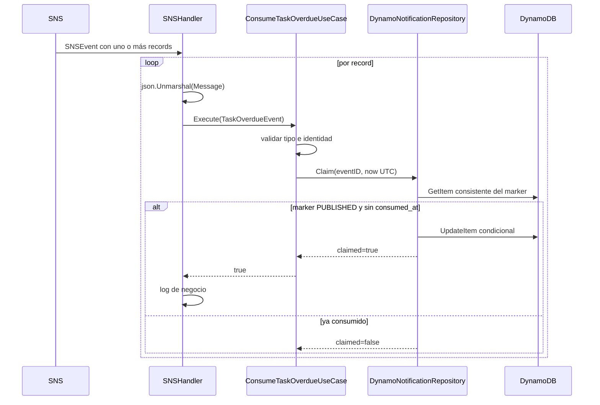

# `lambda_task_overdue_consumer`

## Propósito

Consume mensajes `TaskOverdue` desde SNS y demuestra que un efecto de negocio puede reclamarse una sola vez aunque SNS entregue el mismo evento repetidamente.

El efecto demostrativo actual es escribir un log estructurado. El mecanismo reusable es el claim condicional guardado en el marker del evento.

## Integración

| Elemento | Valor |
| --- | --- |
| Disparador | Suscripción Lambda a SNS |
| Evento | `TaskOverdue` |
| Variable | `PROCESS_TABLE_NAME` |
| Permisos | `dynamodb:GetItem`, `dynamodb:UpdateItem` |
| Timeout | 30 segundos |

Payload dentro de `record.SNS.Message`:

```json
{
  "event_type": "TaskOverdue",
  "event_id": "task-123#2026-09-15T04:00:00Z",
  "task_id": "task-123",
  "owner_id": "alice",
  "description": "Pagar la factura",
  "expired_at": "2026-09-15T04:00:00Z",
  "execution_time": "2026-09-15T05:00:00Z"
}
```

El contrato completo está en [`task-overdue.schema.json`](../../../04-eventos/notificaciones/task-overdue.schema.json).

## Recorrido interno



### 1. Composición

`main.go` carga `PROCESS_TABLE_NAME`, crea el cliente DynamoDB y conecta:

```text
DynamoDB client -> DynamoNotificationRepository -> ConsumeTaskOverdueUseCase -> SNSHandler
```

### 2. Handler SNS

El handler recorre `snsEvent.Records` en orden. Para cada registro:

1. decodifica `record.SNS.Message`, que es un string JSON;
2. llama al caso de uso;
3. si `claimed=true`, escribe un log estructurado con `event_id`, `task_id` y `owner_id`;
4. si `claimed=false`, termina ese registro sin repetir el efecto.

Un JSON inválido o un error de cualquier registro hace que el handler retorne error. SNS puede volver a entregar el lote; los registros ya reclamados quedan protegidos por `consumed_at`.

### 3. Caso de uso

`ConsumeTaskOverdueUseCase.Execute` exige:

- `event_type == "TaskOverdue"`;
- `event_id`, `task_id` y `owner_id` no vacíos;
- `expired_at` válido y distinto de cero.

Luego llama `Claim` con el reloj actual en UTC. Retorna el booleano del repositorio sin convertir una repetición en error.

### 4. Buscar el marker

El repositorio deriva la clave únicamente desde `event_id`:

```text
PK = TASK_OVERDUE#<event_id>
SK = EVENT#TASK_OVERDUE
```

Primero ejecuta `GetItem` con consistencia fuerte. Verifica:

1. que el marker exista;
2. que su estado sea `PUBLISHED`;
3. que aún no contenga `consumed_at`.

Un marker `RESERVED` no es consumible: la Lambda productora todavía no confirmó la publicación en su estado durable.

### 5. Claim condicional

El `UpdateItem` usa:

```text
ConditionExpression:
  status = PUBLISHED AND attribute_not_exists(consumed_at)

UpdateExpression:
  SET consumed_at = <now>, consumer = TASK_OVERDUE_LOG
```

Dos invocaciones podrían leer simultáneamente un marker sin `consumed_at`. La condición se evalúa al escribir: una gana y la otra recibe `ConditionalCheckFailedException`. El repositorio convierte esa excepción en `claimed=false`.

Este patrón resuelve la carrera que una lectura previa por sí sola no resolvería.

## Semántica de resultados

| Situación | Resultado |
| --- | --- |
| Primera entrega válida y publicada | `claimed=true`; escribe marker y log |
| Entrega repetida ya consumida | `claimed=false`; sin log de negocio |
| Carrera perdida contra otro consumidor | `claimed=false`; sin error |
| Marker inexistente | Error; SNS puede reintentar |
| Marker todavía `RESERVED` | Error; SNS puede reintentar |
| Evento inválido | Error |
| Fallo DynamoDB no condicional | Error |

## Alcance de la idempotencia

El claim en DynamoDB es atómico. El log ocurre después del claim. Si la Lambda obtiene el claim y falla antes de escribir el log, una repetición verá `consumed_at` y no lo escribirá. Para un efecto real que no pueda perderse, como cobrar o enviar una notificación, conviene guardar el efecto en la misma transacción cuando sea posible o usar otro outbox/estado que represente `CLAIMED`, `DONE` y recuperación.

## Archivos para estudiar

| Archivo | Responsabilidad |
| --- | --- |
| [`main.go`](main.go) | Construcción de dependencias |
| [`domain/event.go`](domain/event.go) | Contrato Go del evento |
| [`domain/ports/ports.go`](domain/ports/ports.go) | Puertos de consumo y claim |
| [`internal/handler/sns.go`](internal/handler/sns.go) | Adaptación del envelope SNS |
| [`internal/application/consume.go`](internal/application/consume.go) | Validación y reloj |
| [`internal/infraestructure/dynamo_notification_repository.go`](internal/infraestructure/dynamo_notification_repository.go) | Lectura fuerte y actualización condicional |

## Qué verifican las pruebas

- Un evento válido llama `Claim` con la misma identidad y fecha UTC.
- El booleano `claimed` se propaga al handler.
- Eventos con tipo o campos obligatorios inválidos se rechazan.

## Preguntas de repaso

1. ¿Por qué la condición de `UpdateItem` sigue siendo necesaria después del `GetItem`?
2. ¿Por qué un marker `RESERVED` no puede consumirse?
3. ¿Qué significa `claimed=false` y por qué no es un error?
4. ¿Qué riesgo existe entre obtener el claim y ejecutar un efecto externo?
