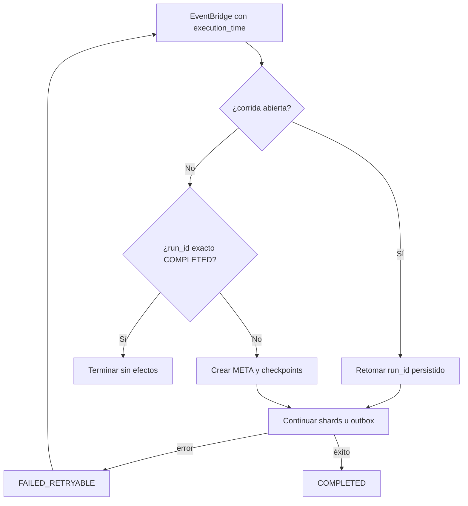

# Reintentos e idempotencia

## Tres repeticiones distintas

El sistema debe manejar tres causas de repetición:

1. Un cliente HTTP repite completar porque no recibió la respuesta.
2. EventBridge vuelve a invocar una corrida que falló.
3. SNS entrega otra vez un mensaje aceptado anteriormente.

Cada una se resuelve en la capa que conoce su identidad: estado de la tarea, `run_id` del batch y `event_id` de la notificación.

## Completar una tarea

La lectura fuerte permite retornar inmediatamente si la tarea ya está `COMPLETED`. Para una tarea `PENDING`, la transacción exige que siga pendiente en el momento de escribir, actualiza el principal y elimina la proyección. Una repetición posterior observa el resultado final y devuelve `200`.

## Corrida programada

La Lambda programada tiene concurrencia reservada en `1`. La regla EventBridge reintenta dos veces, acepta el evento durante dos horas y envía los fallos definitivos a una DLQ.



Cada corrida conserva un checkpoint por shard. El cursor avanza después de guardar todos los markers y eventos de una página. Un fallo repite la página desde el último cursor confirmado y `NotificationMarker` evita crear otro evento para el mismo `task_id + expired_at`.

Los estados recuperables son:

| Estado | Significado al retomar |
| --- | --- |
| `RUNNING` | Todavía hay shards por consultar |
| `PUBLISHING` | Todos los shards terminaron; falta vaciar el outbox |
| `FAILED_RETRYABLE` | Se revisan checkpoints y se continúa desde el progreso durable |

`COMPLETED` remueve las claves de `process_gsi_open`, pero conserva `META` para reconocer un reintento exacto del mismo `execution_time`.

## Ventana DynamoDB–SNS

SNS entrega al menos una vez. Si SNS acepta el mensaje pero falla la confirmación del outbox, la publicación puede repetirse con el mismo `event_id`. El consumidor actualiza `consumed_at` mediante una condición `attribute_not_exists(consumed_at)`; solo la primera entrega ejecuta el efecto demostrativo.

```text
1. outbox = READY_TO_PUBLISH
2. SNS acepta TaskOverdue
3. DynamoDB confirma outbox + marker = PUBLISHED
```

No existe una transacción común entre los pasos 2 y 3. El diseño prioriza no perder el mensaje: conserva una identidad estable para volver inocuo el duplicado.

## Consumidor

El consumidor lee el marker con consistencia fuerte y ejecuta un `UpdateItem` condicionado. La lectura ayuda a validar el estado; la condición resuelve la carrera real entre dos entregas simultáneas.

`ConditionalCheckFailedException` significa que otra invocación obtuvo el claim. Se convierte en `claimed=false`, no en un fallo que requiera reintento.

## Qué queda para investigar un fallo

- `META.status`, `last_error` y `updated_at` muestran el estado general.
- Cada checkpoint conserva `status`, `cursor` y `pages_completed`.
- Los outbox distinguen `READY_TO_PUBLISH` de `PUBLISHED`.
- Los markers muestran reserva, publicación y primer consumo.
- La DLQ conserva invocaciones del schedule que agotaron la política.

La implementación completa se explica en el [README del batch](../02-lambda/functions/lambda_find_expired_task/README.md) y el [README del consumidor](../02-lambda/functions/lambda_task_overdue_consumer/README.md).
