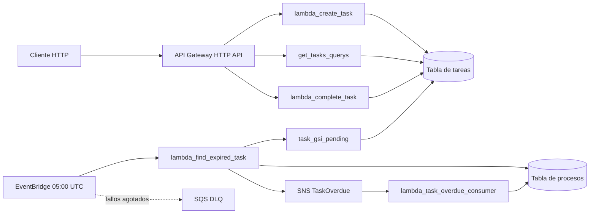
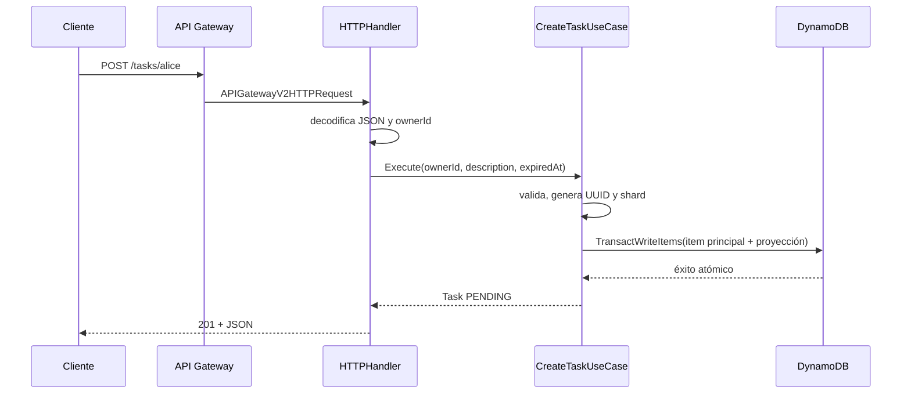
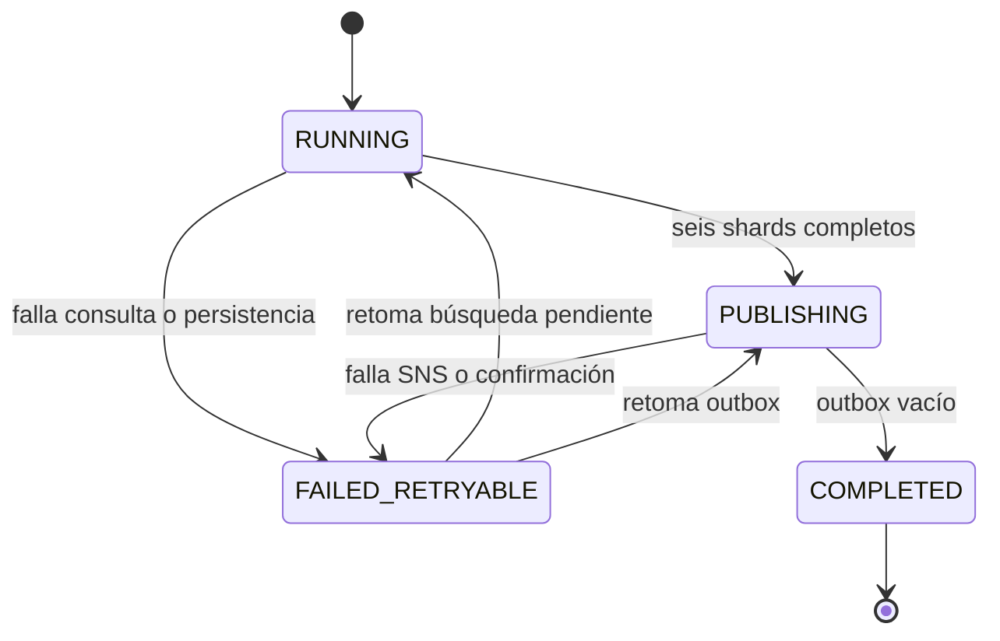

# Arquitectura y flujo global

## 1. Qué problema resuelve el sistema

El sistema administra tareas con fecha de vencimiento. Expone operaciones HTTP para crear, consultar y completar tareas. Además, una ejecución diaria encuentra todas las tareas pendientes cuyo vencimiento ya llegó y publica un evento `TaskOverdue` por cada una.

La dificultad principal está en la búsqueda global de vencidas. Las tareas están agrupadas por dueño, pero el batch necesita cruzar todos los dueños. Un `Scan` leería toda la tabla y su costo crecería con tareas completadas y futuras. El diseño crea un índice disperso repartido en seis shards y consulta únicamente el rango vencido de cada shard.

## 2. Componentes

| Componente | Entrada | Responsabilidad principal | Salida o efecto |
| --- | --- | --- | --- |
| `lambda_create_task` | `POST /tasks/{ownerId}` | Validar y crear una tarea pendiente | Item principal, proyección pendiente y claves del GSI |
| `get_tasks_querys` | Dos rutas `GET` | Listar todas las tareas o solo las pendientes de un dueño | Página de hasta 10 tareas y cursor |
| `lambda_complete_task` | `PATCH /tasks/{ownerId}/{taskId}/complete` | Completar una tarea de forma idempotente | Estado `COMPLETED`, sin proyección ni claves del GSI |
| `lambda_find_expired_task` | EventBridge diario | Buscar vencidas, guardar progreso, preparar y publicar eventos | Mensajes `TaskOverdue` en SNS |
| `lambda_task_overdue_consumer` | SNS | Demostrar consumo idempotente | Marca `consumed_at` una sola vez y escribe un log |
| Tabla de tareas | DynamoDB | Guardar tareas y proyecciones de lectura | Resuelve AP-01 a AP-05 |
| Tabla de procesos | DynamoDB | Guardar corridas, checkpoints, outbox y markers | Recuperación e idempotencia del batch |
| SNS | Eventos | Distribuir `TaskOverdue` | Invoca suscripciones al menos una vez |
| SQS DLQ | Fallos del schedule | Retener invocaciones que agotaron reintentos | Diagnóstico y recuperación manual |

## 3. Diagrama general



## 4. Dos caminos de datos

El ejercicio tiene dos caminos que se conectan mediante DynamoDB:

1. **Camino síncrono HTTP:** el cliente espera una respuesta inmediata de crear, consultar o completar.
2. **Camino asíncrono de vencimientos:** EventBridge inicia un batch, el batch publica en SNS y cada consumidor reacciona con su propio ritmo.

La tabla de tareas conecta ambos caminos. Crear agrega una tarea al conjunto pendiente; completar la retira; el batch consulta ese conjunto sin conocer a los dueños de antemano.

## 5. Flujo de creación



Una única transacción crea dos items:

- El principal responde “obtener todas las tareas del dueño”.
- La proyección responde “obtener pendientes del dueño ordenadas por vencimiento”.

El item principal también recibe las claves del GSI global de pendientes. Si cualquiera de los dos `Put` falla, DynamoDB revierte ambos.

## 6. Flujo de consulta

`get_tasks_querys` usa la misma partición `OWNER_ID#<ownerId>` para ambas rutas:

- `GET /tasks/{ownerId}` filtra por clave con `begins_with(SK, "TASK_ID#")` y devuelve items principales.
- `GET /tasks/{ownerId}/pending` usa `begins_with(SK, "STATUS#PENDING#")` y devuelve proyecciones.

Cada `Query` limita la página a 10. Si DynamoDB devuelve `LastEvaluatedKey`, la Lambda lo serializa como JSON y Base64 URL-safe. El cliente lo reenvía en `?cursor=...`; no necesita conocer su contenido.

## 7. Flujo de completado

La Lambda lee el item principal con consistencia fuerte. Esto permite distinguir tres resultados:

1. No existe: `404`.
2. Ya está `COMPLETED`: devuelve el item existente con `200`; la repetición es idempotente.
3. Está `PENDING`: ejecuta una transacción.

La transacción actualiza el principal y elimina la proyección pendiente. El `Update` cambia `status`, agrega `completed_at` y remueve `GSI1PK/GSI1SK`. La condición `status = PENDING` protege contra cambios concurrentes.

Al retirar las claves del GSI y borrar la proyección, una tarea completada desaparece de las dos consultas de pendientes aunque su item principal se conserva en el historial del dueño.

## 8. Flujo diario de vencimientos

EventBridge envía `execution_time`. Esa fecha cumple dos funciones:

- es el límite inclusivo de la búsqueda, `expired_at <= execution_time`;
- identifica la corrida lógica, `OVERDUE_RUN#<execution_time>`.

La identidad fija es esencial. Un reintento debe retomar la misma corrida y el mismo conjunto temporal, incluso si ocurre minutos después.



La Lambda primero busca una corrida abierta en `process_gsi_open`. Si existe, la retoma. Si no existe, busca el `run_id` exacto para reconocer un reintento de una corrida ya completada. Solo después crea `META` y seis checkpoints en una transacción.

Se lanza un worker Go por shard incompleto. Los shards avanzan en paralelo; las páginas de un shard avanzan en orden. Para cada página:

1. Consulta hasta 25 tareas del shard en `task_gsi_pending`.
2. Convierte cada tarea en un evento con `event_id = task_id#expired_at`.
3. Reserva marker y registro de outbox mediante una transacción.
4. Cuando toda la página quedó reservada, guarda el cursor siguiente.
5. Si ya no hay cursor, marca el checkpoint `COMPLETED`.

Cuando terminan los seis shards, la corrida pasa a `PUBLISHING`. La Lambda lee eventos `READY_TO_PUBLISH`, publica cada uno en SNS y cambia atómicamente el outbox y su marker a `PUBLISHED`. Cuando no queda nada pendiente, marca `META` como `COMPLETED` y remueve las claves que lo hacían visible en `process_gsi_open`.

## 9. Flujo del consumidor

SNS puede entregar el mismo mensaje más de una vez. El consumidor valida el evento y busca su marker `TASK_OVERDUE#<event_id>`. Solo acepta markers cuya publicación ya está `PUBLISHED`.

Luego ejecuta un `UpdateItem` condicionado por:

```text
status = PUBLISHED AND attribute_not_exists(consumed_at)
```

La primera entrega escribe `consumed_at` y devuelve `claimed=true`. Entregas posteriores fallan la condición o ven el atributo existente y devuelven `claimed=false`. El handler escribe el log de negocio únicamente cuando obtuvo el claim.

## 10. Invariantes que debes comprobar al leer el código

| Invariante | Mecanismo |
| --- | --- |
| Una tarea completada no aparece como pendiente | Transacción de completado elimina proyección y claves GSI |
| Crear nunca deja solo media representación | `TransactWriteItems` con los dos `Put` |
| Completar dos veces conserva el resultado | Lectura fuerte y retorno temprano si ya está `COMPLETED` |
| La búsqueda global no usa `Scan` | Seis `Query` dirigidas a `task_gsi_pending` |
| Un reintento usa el mismo límite temporal | `execution_time` persistido en `META` |
| Una página no se da por terminada antes de reservar sus eventos | Checkpoint guardado después del bucle de reservas |
| Un fallo no oculta la corrida | Estados abiertos conservan claves de `process_gsi_open` |
| Completar una corrida la quita del conjunto abierto | `REMOVE GSI1PK, GSI1SK` |
| Un evento tiene identidad estable | `event_id = task_id#expired_at` |
| Un consumidor aplica su efecto una vez | `attribute_not_exists(consumed_at)` |

## 11. Límites conscientes del laboratorio

- El consumidor demuestra el claim idempotente con un log. Un consumidor real ejecutaría su efecto de negocio después de obtener `claimed=true` y debería diseñar también la atomicidad entre claim y efecto.
- SNS estándar ofrece entrega al menos una vez. Si SNS acepta un mensaje y la confirmación en DynamoDB falla, un reintento puede publicarlo otra vez con el mismo `event_id`.
- `ReservedConcurrentExecutions = 1` evita dos invocaciones activas del batch. La coordinación se apoya en esa configuración y en la persistencia del proceso.
- El GSI de DynamoDB tiene consistencia eventual. Una tarea creada o completada puede tardar brevemente en entrar o salir de la vista global; la idempotencia protege repeticiones posteriores.
- Las fechas se guardan como RFC3339. El orden lexicográfico funciona porque la implementación las normaliza a UTC al escribir.
