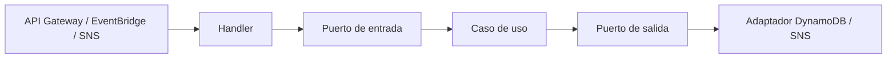

# Recorrido del código

## 1. La estructura que se repite

Las Lambdas separan las decisiones de negocio de AWS mediante una arquitectura de puertos y adaptadores:



| Capa | Pregunta que responde | Ejemplos |
| --- | --- | --- |
| `main.go` | ¿Cómo se conectan las piezas reales? | Carga AWS SDK, crea clientes y hace `lambda.Start` |
| `internal/config` | ¿Qué configuración necesita el proceso? | Nombres de tablas y ARN del topic |
| `internal/handler` | ¿Cómo entra y sale información del runtime? | HTTP, schedule o registros SNS |
| `domain` | ¿Qué conceptos y errores existen? | `Task`, `TaskOverdueEvent`, estados |
| `domain/ports/in` | ¿Qué operación ofrece la aplicación? | `Execute(...)` |
| `internal/application` | ¿Cuál es la secuencia y regla de negocio? | Validación, idempotencia, coordinación |
| `domain/ports/out` | ¿Qué capacidades externas necesita el caso de uso? | Crear, consultar, publicar, guardar checkpoint |
| `internal/infraestructure` | ¿Cómo se habla con AWS? | `QueryInput`, `TransactWriteItemsInput`, `PublishInput` |

Las interfaces permiten probar casos de uso con dobles simples y adaptadores con clientes falsos. Las líneas `var _ Interface = (*Type)(nil)` hacen que el compilador confirme la implementación de cada puerto.

## 2. Orden útil para estudiar una Lambda

1. Lee su README y escribe en una frase su objetivo.
2. Mira `main.go` para dibujar las dependencias reales.
3. Lee el handler y anota la forma exacta de entrada y salida.
4. Lee el puerto de entrada; esa interfaz resume la capacidad del caso de uso.
5. Lee los modelos y errores del dominio.
6. Recorre `Execute` en el caso de uso y enumera sus ramas.
7. Lee el puerto de salida antes del adaptador. Así sabes qué necesita la aplicación sin distraerte con AWS.
8. Traduce cada llamada del adaptador a una operación DynamoDB o SNS.
9. Lee las pruebas para ver qué propiedades se consideran esenciales.
10. Vuelve a `main.go` y comprueba que todas las piezas están conectadas.

## 3. Inyección de dependencias

Por ejemplo, `lambda_create_task/main.go` construye esta cadena:

```text
dynamodb.Client
  -> DynamoTaskRepository
  -> CreateTaskUseCase
  -> HTTPHandler
  -> lambda.Start(handler.Handle)
```

El caso de uso conoce `TaskRepository`, una interfaz pequeña. No importa si la implementación usa DynamoDB, memoria o un fake. El adaptador conoce AWS SDK; el dominio no lo importa.

## 4. Propagación del contexto

Los handlers reciben `context.Context` del runtime y lo pasan al caso de uso; el caso de uso lo pasa al repositorio. Si Lambda cancela o agota su tiempo, las llamadas del SDK reciben esa señal.

El batch usa `context.WithCancel` para cancelar los otros workers cuando falla un shard. Al registrar el estado `FAILED_RETRYABLE` usa `context.WithoutCancel(ctx)`, porque necesita intentar guardar el error aunque el contexto de workers ya haya sido cancelado.

## 5. Tratamiento de errores

Los errores de dominio permiten que el handler elija una respuesta estable:

- `ErrInvalidTask` se convierte en `400`.
- `ErrTaskNotFound` se convierte en `404`.
- `ErrTaskNotPending` y colisiones se convierten en `409`.
- errores inesperados se ocultan detrás de un mensaje `500` genérico.

Los casos de uso envuelven errores con `%w`. Esto agrega contexto para logs y conserva la causa para `errors.Is` y `errors.As`.

En el batch no hay respuesta HTTP. Retornar un error hace que EventBridge aplique reintentos. Antes de retornarlo, el caso de uso intenta guardar `FAILED_RETRYABLE` y `last_error`.

## 6. Fechas y orden

El sistema convierte fechas a UTC y escribe RFC3339/RFC3339Nano. Con una representación uniforme, el orden textual coincide con el cronológico, propiedad usada por las sort keys.

Tres fechas no deben confundirse:

| Fecha | Significado |
| --- | --- |
| `created_at` | Momento de creación de la tarea |
| `expired_at` | Fecha límite de esa tarea |
| `execution_time` | Corte fijo del batch diario |

`completed_at`, `published_at` y `consumed_at` son evidencias de transiciones posteriores.

## 7. Cómo seguir un ejemplo completo

Usa esta tarea imaginaria:

```text
owner_id   = alice
task_id    = task-123
expired_at = 2026-09-15T04:00:00Z
shard      = 03
```

Sigue estos cambios:

1. Creación: aparecen `TASK_ID#task-123`, la proyección `STATUS#PENDING#...` y las claves `SHARD#03#STATUS#PENDING`.
2. Consulta del dueño: la ruta general lee el principal; la ruta pending lee la proyección.
3. Batch a las `05:00Z`: el rango del shard 03 incluye `04:00Z`; se crean marker y outbox.
4. Publicación: SNS recibe `event_id = task-123#2026-09-15T04:00:00Z`.
5. Consumo: el marker recibe `consumed_at` una sola vez.
6. Completado: desaparecen proyección y claves GSI; el principal queda `COMPLETED`.

## 8. Qué cubren las pruebas

| Lambda | Propiedades principales verificadas |
| --- | --- |
| Crear | validación temporal, UUID/shard, dos items y claves GSI |
| Consultar | expresiones de `Query`, páginas, mapeo y propagación de errores |
| Completar | actualización y borrado atómicos, repetición idempotente |
| Buscar vencidas | seis shards, recuperación parcial, outbox ante error, cursores, configuración, handler y SNS |
| Consumir | validación y claim por `event_id` |

Las pruebas de CDK confirman recursos, rutas, schedule, permisos y ajustes operativos. El script [`scripts/local/verify.sh`](../scripts/local/verify.sh) ejecuta todas las suites y el synth.

## 9. Preguntas para autoevaluación

1. ¿Por qué una proyección pendiente necesita su propio item si el principal ya tiene `status`?
2. ¿Qué ocurriría si completar cambiara `status` pero conservara `GSI1PK/GSI1SK`?
3. ¿Por qué el batch recibe `execution_time` en vez de calcular siempre `time.Now()`?
4. ¿Por qué el checkpoint se guarda después de reservar toda la página?
5. ¿Qué fallo permite que SNS publique dos veces el mismo `event_id`?
6. ¿Cómo diferencia el consumidor una primera entrega de una repetición?
7. ¿Por qué seis `Query` son distintas de un `Scan`?
8. ¿Qué información queda en DynamoDB para investigar una corrida fallida?
